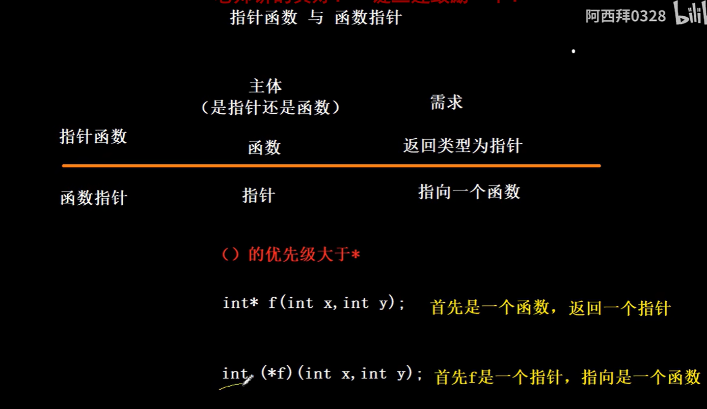

# **函数指针与指针函数**



指针函数：`int* fun(int x,int y)`;

函数指针：`int (*fun)(int x,int y)`;

## **1.函数指针**

### 1.1 声明

```cpp
#include <iostream>
using namespace std;
int func(int x){
    cout << endl;
}
int main() {


    int (*fun)(int x);  //声明一个函数指针
    fun = func;     // 将func函数的首地址赋给指针fun
    //func = &func
    //赋值时函数func不带括号，也不带参数，由于func代表函数的首地址，因此经过赋值以后，指针fun就指向函数func(x)的首地址。
    cout << (void *)fun << endl;
    //将函数指针 fun 转换为 void 指针类型
    return 0;
}
```


### 1.2 调用方法

```cpp
#include <iostream>
using namespace std;
int func(int x){

    return x;
}
int main() {
    int (*fun)(int x);  //声明一个函数指针
    fun = func;     // 将func函数的首地址赋给指针fun
    cout << fun(1) << endl;  // 输出1
    cout << (*fun)(3) << endl; // 输出3
    // fun(1) 等价于 (*fun)(1)
    return 0;
}
```

### 1.3 作为函数参数

```cpp
#include <iostream>
using namespace std;
int fun(int (*pfun)(int, int), int a, int b){
    return pfun(a,b);
}


int max(int a, int b){
    return a>b ? a : b;
}

int main(){
    int maxval = fun(max,1,2); //注意可以直接传入函数名，作为参数
    cout << maxval << endl; //输出2
}
```

### 1.4 函数指针数组

- 函数指针数组是一个元素均为函数指针的数组。
- 写法:`int (*arr[n]) (int x,int y,...)`

```cpp
#include <iostream>
using namespace std;

//返回两个数中较大的一个
int max(int a, int b){
    return a>b ? a : b;
}

//返回两个数中较小的一个
int min(int a, int b){
    return a<b ? a : b;
}

int main(){
    int x, y, maxval, minval;

    int(*arr[2])(int x, int y) = { max, min};

    maxval = arr[0](1,2); // 2
    minval = arr[1](1,2); // 1
    cout << maxval << " " << minval << endl;
    return 0;
}


```


