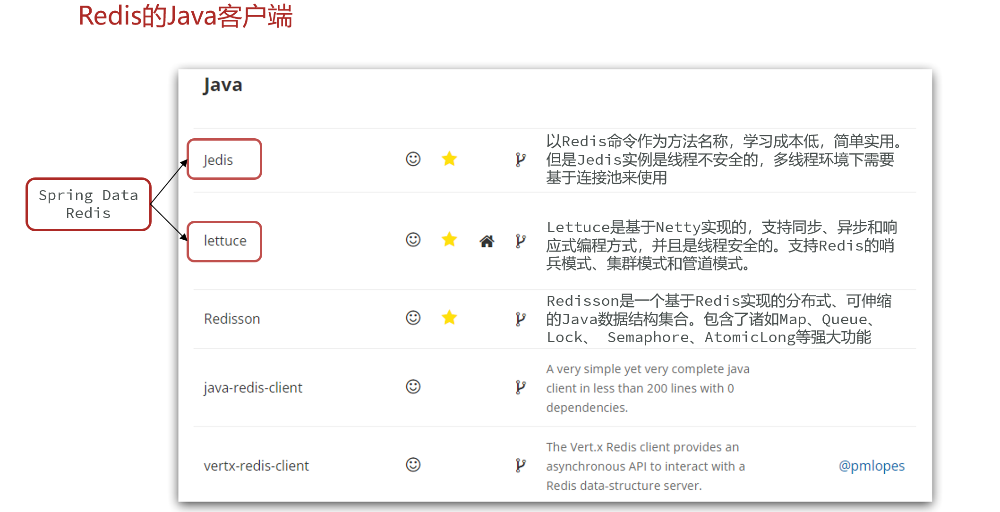

# jedis


## jedis直连方式

### 1.引入依赖
```java
<dependency>
    <groupId>redis.clients</groupId>
    <artifactId>jedis</artifactId>
    <version>3.7.0</version>
</dependency>
```

### 2.建立连接
```java
private Jedis jedis;
@BeforeEach
void setUp() {
    // 建立连接
    jedis = new Jedis("192.168.150.101", 6379);
    // 设置密码
    jedis.auth("123321");
    // 选择库
    jedis.select(0);
}
```

### 3.测试string
```java
@Test
void testString() {
    // 插入数据，方法名称就是redis命令名称，非常简单
    String result = jedis.set("name", "张三");
    System.out.println("result = " + result);     
    // 获取数据   
    String name = jedis.get("name");    
    System.out.println("name = " + name);
}
```
### 4.释放资源
```java
@AfterEach
void tearDown() {
    // 释放资源    
    if (jedis != null) {
        jedis.close();    
    }
}
```

## jedis连接池
        Jedis本身是线程不安全的，并且频繁的创建和销毁连接会有性能损耗，因此最好使用使用Jedis连
    接池代替Jedis的直连方式。
    
```java
public class JedisConnectionFactory {
    private static final JedisPool jedisPool;
    static {
        JedisPoolConfig jedisPoolConfig = new JedisPoolConfig();
        // 最大连接
            edisPoolConfig.setMaxTotal(8);
        // 最大空闲连接
        jedisPoolConfig.setMaxIdle(8);
        // 最小空闲连接
        jedisPoolConfig.setMinIdle(0);
        // 设置最长等待时间， ms
        jedisPoolConfig.setMaxWaitMillis(200);
        jedisPool = new JedisPool(jedisPoolConfig, "192.168.150.101", 6379,1000, "123321");
    }
    // 获取Jedis对象
    public static Jedis getJedis(){
        return jedisPool.getResource();
    }
}
```